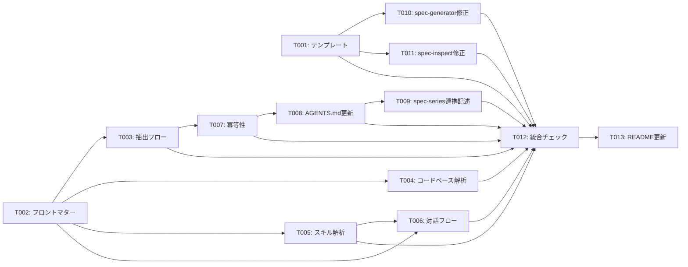

# タスクリスト - spec-rules-init

## 1. 概要

spec-rules-init スキルの SKILL.md と references/ を作成するタスクリスト。

## 2. タスク一覧

### Phase 1: テンプレート作成
- [x] T001: [REQ-003][REQ-004] coding-rules.md テンプレート作成（日英）
- [x] T002: [REQ-006] SKILL.md フロントマター + Language Rules 作成

### Phase 2: SKILL.md コアロジック
- [x] T003: [REQ-001] ルール抽出フローの記述
- [x] T004: [REQ-008] コードベース解析フローの記述
- [x] T005: [REQ-010] インストール済みスキル解析フローの記述
- [x] T006: [REQ-002][REQ-003] 対話補完フロー + 出力先ヒアリングの記述
- [x] T007: [REQ-005][NFR-002] 既存ファイル検出と冪等性の記述
- [x] T008: [REQ-007] AGENTS.md / CLAUDE.md 参照追記フローの記述
- [x] T009: [REQ-009] spec-series 連携の記述

### Phase 3: spec-series SKILL.md 修正
- [x] T010: [REQ-009][REQ-010] spec-generator SKILL.md の修正（coding-rules.md + スキル由来ルール参照追加）
- [x] T011: [REQ-009] spec-inspect SKILL.md の修正（coding-rules.md 参照追加）

### Phase 4: 統合・品質
- [x] T012: SKILL.md 全体の統合とスタイルガイド準拠チェック
- [x] T013: README.md / README.ja.md の更新

## 3. タスク詳細

### T001: coding-rules.md テンプレート作成（日英）
- 要件ID: REQ-003, REQ-004
- 設計書参照: design.md §5 出力テンプレート
- 依存関係: なし
- 推定時間: 30分
- 対象ファイル:
  - `skills/spec-rules-init/references/rules-template.md`（新規）
  - `skills/spec-rules-init/references/rules-template.ja.md`（新規）
- 完了条件:
  - [x] 英語テンプレートに全6カテゴリのセクション構造が含まれている
  - [x] 日本語テンプレートが英語版と同一構造で記述されている
  - [x] 強制度タグ（MUST/SHOULD/MAY）の使用例が含まれている
  - [x] 出典セクションのフォーマットが含まれている
  - [x] プロジェクト種別ごとの推奨ルール一覧が含まれている

### T002: SKILL.md フロントマター + Language Rules 作成
- 要件ID: REQ-006
- 設計書参照: design.md §6 ファイル構成
- 依存関係: なし
- 推定時間: 15分
- 対象ファイル:
  - `skills/spec-rules-init/SKILL.md`（新規）
- 完了条件:
  - [x] YAML フロントマターに name, description（英語 + 日英トリガー）, license が含まれている
  - [x] `## Language Rules` セクションが spec-series パターンに準拠している
  - [x] name がディレクトリ名 `spec-rules-init` と一致している

### T003: ルール抽出フローの記述
- 要件ID: REQ-001
- 設計書参照: design.md §3 ルール抽出フロー
- 依存関係: T002
- 推定時間: 45分
- 対象ファイル:
  - `skills/spec-rules-init/SKILL.md`（追記）
- 完了条件:
  - [x] 初期チェック手順（pwd、ファイル検出）が記述されている
  - [x] 検出対象ファイルの一覧と優先度が記述されている
  - [x] カテゴリごとの抽出パターン（キーワード）が記述されている
  - [x] 抽出結果の提示フォーマットが記述されている
  - [x] MCP ツール名のハードコードがない（CON-003 準拠）

### T004: コードベース解析フローの記述
- 要件ID: REQ-008
- 設計書参照: design.md §3.4 コードベース解析
- 依存関係: T002
- 推定時間: 45分
- 対象ファイル:
  - `skills/spec-rules-init/SKILL.md`（追記）
- 完了条件:
  - [x] ディレクトリ構造の解析手順（レイヤー分離、テスト配置パターン検出）が記述されている
  - [x] ファイル命名規則の検出ロジック（ケース分布集計、多数派判定）が記述されている
  - [x] 主要ライブラリの解析手順（package.json / go.mod 等からの検出と推奨ルール生成）が記述されている
  - [x] コードパターン（import 形式、export 形式）の検出手順が記述されている
  - [x] コードベースが存在しない場合のスキップ処理が記述されている
  - [x] 解析結果と規約ファイル抽出結果のマージ方針が記述されている

### T005: インストール済みスキル解析フローの記述
- 要件ID: REQ-010
- 設計書参照: design.md §3.5 インストール済みスキル解析
- 依存関係: T002
- 推定時間: 45分
- 対象ファイル:
  - `skills/spec-rules-init/SKILL.md`（追記）
- 完了条件:
  - [x] `~/.claude/skills/` および `.claude/skills/` のスキャン手順が記述されている
  - [x] SKILL.md の description からフレームワーク適合度を判定するロジックが記述されている
  - [x] 適合スキル一覧の AskUserQuestion（bilingual）が記述されている
  - [x] スキル由来ルールの抽出と優先度マッピング（優先度3: `[SHOULD]`/`[MAY]`）が記述されている
  - [x] 優先度間の矛盾検出と警告表示のロジックが記述されている
  - [x] coding-rules.md の出典セクションへのスキル名記載（`Source: skill/{name}`）が記述されている
  - [x] スキルが未インストールの場合のスキップ処理が記述されている

### T006: 対話補完フロー + 出力先ヒアリングの記述
- 要件ID: REQ-002, REQ-003
- 設計書参照: design.md §4.2 出力先パスのヒアリング, §4.3 対話補完
- 依存関係: T002, T005
- 推定時間: 30分
- 対象ファイル:
  - `skills/spec-rules-init/SKILL.md`（追記）
- 完了条件:
  - [x] 出力先パスの AskUserQuestion（デフォルト: `docs/coding-rules.md`）が記述されている
  - [x] AskUserQuestion を使った対話補完の例が記述されている
  - [x] 不足カテゴリの検出ロジックが記述されている
  - [x] AskUserQuestion のテキストが bilingual（"English" / "日本語"）で記述されている
  - [x] プロジェクト種別に応じた推奨ルールの提示が記述されている

### T007: 既存ファイル検出と冪等性の記述
- 要件ID: REQ-005, NFR-002
- 設計書参照: design.md §4.4 既存ファイル検出
- 依存関係: T003
- 推定時間: 20分
- 対象ファイル:
  - `skills/spec-rules-init/SKILL.md`（追記）
- 完了条件:
  - [x] 既存 coding-rules.md の検出フローが記述されている
  - [x] 差分表示 → 上書き確認の手順が記述されている
  - [x] `--force` オプションの説明が記述されている
  - [x] Options セクションに `--force` が含まれている

### T008: AGENTS.md / CLAUDE.md 参照追記フローの記述
- 要件ID: REQ-007
- 設計書参照: design.md §5.3 規約ファイル更新
- 依存関係: T007
- 推定時間: 20分
- 対象ファイル:
  - `skills/spec-rules-init/SKILL.md`（追記）
- 完了条件:
  - [x] AGENTS.md / CLAUDE.md の存在確認ロジックが記述されている
  - [x] シンボリックリンク検出（CLAUDE.md → AGENTS.md）のスキップ処理が記述されている
  - [x] 追記確認の AskUserQuestion（bilingual）が記述されている
  - [x] 追記内容の例（coding-rules.md のパスと説明文）が記述されている
  - [x] ファイルが存在しない場合のスキップ + 警告が記述されている

### T009: spec-series 連携の記述
- 要件ID: REQ-009
- 設計書参照: design.md §5.4 spec-series 連携
- 依存関係: T008
- 推定時間: 20分
- 対象ファイル:
  - `skills/spec-rules-init/SKILL.md`（追記）
- 完了条件:
  - [x] spec-generator / spec-inspect が coding-rules.md を参照する旨の説明が記述されている
  - [x] 生成後の案内メッセージ（spec-generator / spec-inspect との連携通知）が記述されている
  - [x] Post-Completion Actions セクションに連携案内が含まれている

### T010: spec-generator SKILL.md の修正
- 要件ID: REQ-009, REQ-010
- 設計書参照: design.md §5.4.1 spec-generator SKILL.md の修正
- 依存関係: T001（テンプレート完成後）
- 推定時間: 30分
- 対象ファイル:
  - `skills/spec-generator/SKILL.md`（修正）
  - `skills/spec-generator/references/design.md`（修正）
  - `skills/spec-generator/references/design.ja.md`（修正）
- 完了条件:
  - [x] Initial Context Check に coding-rules.md の存在チェック手順が追加されている
  - [x] design フェーズの Phase Execution に coding-rules.md 参照の指示が追加されている
  - [x] design フェーズで coding-rules.md 内のスキル由来ルール（`Source: skill/{name}`）も設計に反映する指示が追加されている
  - [x] references/design.md に coding-rules.md 参照時の生成手順が追加されている
  - [x] references/design.ja.md に同等の日本語説明が追加されている
  - [x] SKILL.md が 500 行以下を維持している

### T011: spec-inspect SKILL.md の修正
- 要件ID: REQ-009
- 設計書参照: design.md §5.4.2 spec-inspect SKILL.md の修正
- 依存関係: T001（テンプレート完成後）
- 推定時間: 30分
- 対象ファイル:
  - `skills/spec-inspect/SKILL.md`（修正）
- 完了条件:
  - [x] Step 2（Read Specifications）に coding-rules.md の読み込みが追加されている
  - [x] Check 13（Project Rule Compliance）に coding-rules.md の読み取りと `[MUST]` ルール検証が追加されている
  - [x] coding-rules.md 固有の検出パターン例（命名規則違反、テスト基準未達等）が記述されている
  - [x] SKILL.md が 500 行以下を維持している

### T012: SKILL.md 全体の統合とスタイルガイド準拠チェック
- 要件ID: -（品質タスク）
- 設計書参照: AGENTS.md, docs/skill-style-guide.md
- 依存関係: T003, T004, T005, T006, T007, T008, T009, T010, T011
- 推定時間: 30分
- 対象ファイル:
  - `skills/spec-rules-init/SKILL.md`（最終調整）
  - `skills/spec-generator/SKILL.md`（修正確認）
  - `skills/spec-inspect/SKILL.md`（修正確認）
- 完了条件:
  - [x] spec-rules-init/SKILL.md が 500 行以下
  - [x] spec-generator/SKILL.md が 500 行以下を維持
  - [x] spec-inspect/SKILL.md が 500 行以下を維持
  - [x] 全セクションヘッダーが英語
  - [x] AskUserQuestion テキストが bilingual
  - [x] MCP ツール名のハードコードがない
  - [x] 参照ファイルがすべて存在する
  - [x] Error Handling セクションが含まれている
  - [x] Usage Examples セクションが含まれている
  - [x] Post-Completion Actions セクションが含まれている
  - [x] NFR-001: SKILL.md が skills.sh フォーマットに準拠している
  - [x] NFR-003: 対話ラウンド数が最小限に設計されている
  - [x] CON-001: 出力が Markdown のみ
  - [x] CON-003: MCP ツール名のハードコードがない
  - [x] REQ-008: コードベース解析フローが正しく記述されている
  - [x] REQ-009: spec-generator / spec-inspect の修正が正しく適用されている
  - [x] REQ-010: インストール済みスキル解析フローが正しく記述されている

### T013: README.md / README.ja.md の更新
- 要件ID: -（ドキュメントタスク）
- 依存関係: T012
- 推定時間: 15分
- 対象ファイル:
  - `README.md`（修正: skills テーブルに追加）
  - `README.ja.md`（修正: skills テーブルに追加）
- 完了条件:
  - [x] Skills テーブルに spec-rules-init の行が追加されている
  - [x] Installation セクションに spec-rules-init のインストールコマンドが追加されている
  - [x] Quick Start に使用例が追加されている

## 4. 優先度

| タスク | 優先度 | 理由 |
|-------|--------|------|
| T001 | High | テンプレートが SKILL.md の参照先（全フローの前提） |
| T002 | High | SKILL.md の骨格（他タスクの追記先） |
| T003 | High | コア機能（ルール抽出） |
| T004 | High | コア機能（コードベース解析） |
| T005 | High | コア機能（インストール済みスキル解析） |
| T006 | High | コア機能（対話補完 + 出力先ヒアリング） |
| T007 | Medium | 冪等性（初回実行では不要だが安全性に必要） |
| T008 | Medium | AGENTS.md/CLAUDE.md 参照追記（他エージェントの発見性向上） |
| T009 | Medium | spec-series 連携記述（ツールチェーン統合） |
| T010 | High | spec-generator SKILL.md 修正（既存スキルの拡張 + スキル由来ルール） |
| T011 | High | spec-inspect SKILL.md 修正（既存スキルの拡張） |
| T012 | Medium | 品質保証（統合チェック） |
| T013 | Low | ドキュメント更新 |

## 5. 依存関係図

## 6. 並列実行計画

| フェーズ | 並列実行可能タスク | 推定時間 |
|---------|-------------------|---------|
| 1 | T001, T002 | 30分 |
| 2 | T003, T004, T005 | 45分 |
| 3 | T006 | 30分 |
| 4 | T007 | 20分 |
| 5 | T008 | 20分 |
| 6 | T009, T010, T011 | 30分 |
| 7 | T012 | 30分 |
| 8 | T013 | 15分 |

**合計推定時間**: 約3.5時間（並列実行時）
