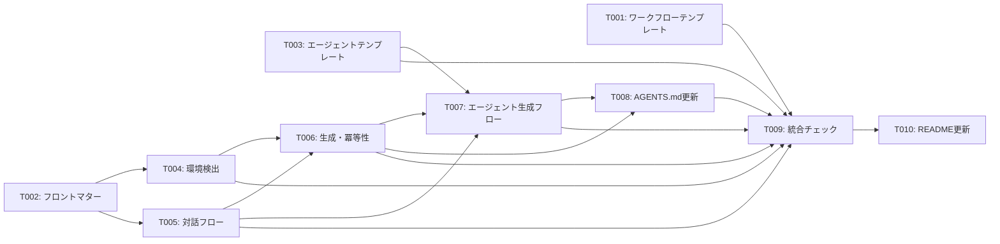

# タスクリスト - spec-workflow-init

## 1. 概要

spec-workflow-init スキルの SKILL.md と references/ を作成するタスクリスト。

## 2. タスク一覧

### Phase 1: テンプレート作成
- [x] T001: [REQ-004][REQ-005] workflow テンプレート作成（日英）
- [x] T002: [REQ-006] SKILL.md フロントマター + Language Rules 作成
- [x] T003: [REQ-010][REQ-011] サブエージェント定義テンプレート作成（Claude Code + Codex）

### Phase 2: SKILL.md コアロジック
- [x] T004: [REQ-001] 環境検出フローの記述
- [x] T005: [REQ-002][REQ-003][REQ-008][REQ-009][REQ-010] 対話フロー + 出力先ヒアリングの記述
- [x] T006: [REQ-003][NFR-002] 生成・冪等性フローの記述
- [x] T007: [REQ-010] サブエージェント生成フローの記述
- [x] T008: [REQ-007] AGENTS.md / CLAUDE.md 参照追記フローの記述

### Phase 3: 統合・品質
- [x] T009: SKILL.md 全体の統合とスタイルガイド準拠チェック
- [x] T010: README.md / README.ja.md の更新

## 3. タスク詳細

### T001: workflow テンプレート作成（日英）
- 要件ID: REQ-004, REQ-005, REQ-008, REQ-009
- 設計書参照: design.md §5 出力テンプレート, §6.2 テンプレートの内容
- 依存関係: なし
- 推定時間: 1.5時間
- 対象ファイル:
  - `skills/spec-workflow-init/references/workflow-template.md`（新規）
  - `skills/spec-workflow-init/references/workflow-template.ja.md`（新規）
- 完了条件:
  - [x] 全セクション構造（Workflow Overview 〜 Agent Roles）が含まれている
  - [x] 開発スタイル別の工程順序パターン（Implementation First / TDD / BDD）が含まれている
  - [x] E2E テストレベル別の記述（API のみ / API + ブラウザ）が含まれている
  - [x] プロジェクト種別ごとのコマンド例（NestJS、Next.js、Go、Python）が含まれている
  - [x] エージェントロールの定義例（並列実行パターン含む）が含まれている
  - [x] 品質ゲートのチェックリスト例が含まれている
  - [x] Mermaid フロー図のテンプレートが含まれている
  - [x] PR テンプレートの例が含まれている
  - [x] 日本語テンプレートが英語版と同一構造
  - [x] プレースホルダー（`{variable}`）が明確に定義されている

### T002: SKILL.md フロントマター + Language Rules 作成
- 要件ID: REQ-006
- 設計書参照: design.md §6 ファイル構成
- 依存関係: なし
- 推定時間: 15分
- 対象ファイル:
  - `skills/spec-workflow-init/SKILL.md`（新規）
- 完了条件:
  - [x] YAML フロントマターに name, description（英語 + 日英トリガー）, license が含まれている
  - [x] `## Language Rules` セクションが spec-series パターンに準拠している
  - [x] name がディレクトリ名 `spec-workflow-init` と一致している

### T003: サブエージェント定義テンプレート作成（Claude Code + Codex）
- 要件ID: REQ-010, REQ-011
- 設計書参照: design.md §6.3 サブエージェント生成フロー, §6.4 サブエージェントテンプレートの内容, §6.5 Codex TOML 構造
- 依存関係: なし
- 推定時間: 1.5時間
- 対象ファイル:
  - **Claude Code 用**（`references/agents/claude/`）:
    - `skills/spec-workflow-init/references/agents/claude/workflow-implementer.md`（新規）
    - `skills/spec-workflow-init/references/agents/claude/workflow-implementer.ja.md`（新規）
    - `skills/spec-workflow-init/references/agents/claude/workflow-reviewer.md`（新規）
    - `skills/spec-workflow-init/references/agents/claude/workflow-reviewer.ja.md`（新規）
    - `skills/spec-workflow-init/references/agents/claude/workflow-tester.md`（新規）
    - `skills/spec-workflow-init/references/agents/claude/workflow-tester.ja.md`（新規）
  - **Codex 用**（`references/agents/codex/`）:
    - `skills/spec-workflow-init/references/agents/codex/workflow-implementer.toml`（新規）
    - `skills/spec-workflow-init/references/agents/codex/workflow-reviewer.toml`（新規）
    - `skills/spec-workflow-init/references/agents/codex/workflow-tester.toml`（新規）
- 完了条件:
  - [x] workflow-implementer: coding-rules.md 参照、開発スタイル別の動作指示が含まれている
  - [x] workflow-reviewer: coding-rules.md 基準のレビューチェックリスト、重大度分類が含まれている
  - [x] workflow-tester: テスト方針、カバレッジ基準、E2E テストレベル対応が含まれている
  - [x] 全テンプレートにプレースホルダー（`{coding_rules_path}`, `{workflow_path}`, `{test_command}` 等）が含まれている
  - [x] Claude Code: 日本語テンプレートが英語版と同一構造で、日本人エンジニアが直接編集しやすい記述になっている
  - [x] Claude Code: 各エージェント定義が `.claude/agents/` の仕様に準拠している
  - [x] Codex: TOML フォーマットで `developer_instructions` フィールドにエージェント指示が記述されている
  - [x] Codex: `.codex/agents/` の仕様に準拠し、`name`, `model`, `[tools]` セクションが含まれている

### T004: 環境検出フローの記述
- 要件ID: REQ-001
- 設計書参照: design.md §3 環境検出フロー
- 依存関係: T002
- 推定時間: 45分
- 対象ファイル:
  - `skills/spec-workflow-init/SKILL.md`（追記）
- 完了条件:
  - [x] 初期チェック手順（pwd、ls -la）が記述されている
  - [x] 検出対象の一覧と検出方法が記述されている
  - [x] 検出結果の提示フォーマットが記述されている
  - [x] MCP ツール名のハードコードがない（CON-003 準拠）

### T005: 対話フロー + 出力先ヒアリングの記述
- 要件ID: REQ-002, REQ-003, REQ-008, REQ-009, REQ-010
- 設計書参照: design.md §4.2〜§4.7
- 依存関係: T002
- 推定時間: 1時間
- 対象ファイル:
  - `skills/spec-workflow-init/SKILL.md`（追記）
- 完了条件:
  - [x] 出力先パスの AskUserQuestion（デフォルト: `docs/issue-to-pr-workflow.md`）が記述されている
  - [x] ブランチ戦略（ベースブランチ＝PRターゲット）の質問が含まれている
  - [x] ブランチ命名規則の AskUserQuestion（`feature/{issue}-{slug}` / `{issue}-{slug}` / `{type}/{issue}-{slug}`）が記述されている
  - [x] 品質ゲートの質問が含まれている
  - [x] 開発スタイル選択の AskUserQuestion（Implementation First / TDD / BDD）が記述されている
  - [x] E2E テストレベル選択の AskUserQuestion（API のみ / API + ブラウザ）が記述されている
  - [x] 並列実行オプションの AskUserQuestion（直列 / 並列）が記述されている
  - [x] サブエージェント生成確認の AskUserQuestion（並列選択時のみ）が記述されている
  - [x] プロジェクト種別に応じた追加質問のパターンが記述されている
  - [x] AskUserQuestion のテキストが bilingual で記述されている

### T006: 生成・冪等性フローの記述
- 要件ID: REQ-003, NFR-002
- 設計書参照: design.md §4.5 既存ファイル検出, §5 出力テンプレート
- 依存関係: T004, T005
- 推定時間: 20分
- 対象ファイル:
  - `skills/spec-workflow-init/SKILL.md`（追記）
- 完了条件:
  - [x] テンプレート読み込み → プレースホルダー埋め込み → 出力の手順が記述されている
  - [x] 開発スタイルに応じた工程順序の切り替えロジックが記述されている
  - [x] 既存ファイル検出 → 差分表示 → 上書き確認のフローが記述されている
  - [x] `--force` オプションの説明が記述されている
  - [x] Options セクションに `--force` が含まれている

### T007: サブエージェント生成フローの記述（Claude Code + Codex）
- 要件ID: REQ-010, REQ-011
- 設計書参照: design.md §6.3 サブエージェント生成フロー, §6.5 Codex TOML 構造
- 依存関係: T005, T006
- 推定時間: 45分
- 対象ファイル:
  - `skills/spec-workflow-init/SKILL.md`（追記）
- 完了条件:
  - [x] 環境検出ロジック（`.claude/` / `.codex/` の存在確認）が記述されている
  - [x] Claude Code 用: Language Rules に従ったテンプレート選択ロジックが記述されている
  - [x] Claude Code 用: `.claude/agents/` ディレクトリの作成・既存ファイル確認のフローが記述されている
  - [x] Codex 用: `.codex/agents/` ディレクトリの作成・既存ファイル確認のフローが記述されている
  - [x] Codex 用: `.codex/config.toml` の `[agents]` セクション更新と `[features] multi_agent = true` 追記のフローが記述されている
  - [x] プレースホルダー置換の手順（coding_rules_path, workflow_path, test_command 等）が記述されている
  - [x] 生成されるエージェント定義ファイルの一覧と説明が環境別に記述されている
  - [x] 並列実行を選択しなかった場合のスキップ処理が記述されている
  - [x] 環境未検出時のフォールバック（手順のみ記載）が記述されている

### T008: AGENTS.md / CLAUDE.md 参照追記フローの記述
- 要件ID: REQ-007
- 設計書参照: design.md §5.4 規約ファイル更新
- 依存関係: T006, T007
- 推定時間: 20分
- 対象ファイル:
  - `skills/spec-workflow-init/SKILL.md`（追記）
- 完了条件:
  - [x] AGENTS.md / CLAUDE.md の存在確認ロジックが記述されている
  - [x] シンボリックリンク検出（CLAUDE.md → AGENTS.md）のスキップ処理が記述されている
  - [x] 追記確認の AskUserQuestion（bilingual）が記述されている
  - [x] 追記内容の例（issue-to-pr-workflow.md のパスと説明文）が記述されている
  - [x] ファイルが存在しない場合のスキップ + 警告が記述されている

### T009: SKILL.md 全体の統合とスタイルガイド準拠チェック
- 要件ID: -（品質タスク）
- 設計書参照: AGENTS.md, docs/skill-style-guide.md
- 依存関係: T004, T005, T006, T007, T008
- 推定時間: 30分
- 対象ファイル:
  - `skills/spec-workflow-init/SKILL.md`（最終調整）
- 完了条件:
  - [x] SKILL.md が 500 行以下
  - [x] 全セクションヘッダーが英語
  - [x] AskUserQuestion テキストが bilingual
  - [x] MCP ツール名のハードコードがない
  - [x] 参照ファイルがすべて存在する（agents/ 含む）
  - [x] Error Handling セクションが含まれている
  - [x] Usage Examples セクションが含まれている
  - [x] Post-Completion Actions セクションが含まれている
  - [x] NFR-001: SKILL.md が skills.sh フォーマットに準拠している
  - [x] NFR-003: 環境検出・対話・生成の全工程が効率的に設計されている
  - [x] NFR-004: 生成コマンド例が copy-paste で即実行可能
  - [x] CON-001: 出力が Markdown のみ
  - [x] REQ-008: 開発スタイル選択フローが正しく記述されている
  - [x] REQ-009: E2E テストレベル選択フローが正しく記述されている
  - [x] REQ-010: 並列実行・サブエージェント生成フローが正しく記述されている（Claude Code + Codex）
  - [x] REQ-010: 環境検出ロジック（.claude/ / .codex/）が正しく記述されている
  - [x] REQ-011: Claude Code テンプレートが日英両方存在する（references/agents/claude/）
  - [x] REQ-011: Codex テンプレートが TOML フォーマットで存在する（references/agents/codex/）

### T010: README.md / README.ja.md の更新
- 要件ID: -（ドキュメントタスク）
- 依存関係: T009
- 推定時間: 15分
- 対象ファイル:
  - `README.md`（修正: skills テーブルに追加）
  - `README.ja.md`（修正: skills テーブルに追加）
- 完了条件:
  - [x] Skills テーブルに spec-workflow-init の行が追加されている
  - [x] Installation セクションにインストールコマンドが追加されている
  - [x] Quick Start に使用例が追加されている

## 4. 優先度

| タスク | 優先度 | 理由 |
|-------|--------|------|
| T001 | High | テンプレートが SKILL.md の参照先 |
| T002 | High | SKILL.md の骨格 |
| T003 | High | サブエージェントテンプレート（Claude Code + Codex、並列実行の前提） |
| T004 | High | コア機能（環境検出） |
| T005 | High | コア機能（対話 + 開発スタイル/E2E/並列実行選択） |
| T006 | Medium | 冪等性（生成・上書き制御） |
| T007 | High | サブエージェント生成フロー（環境検出 + Claude Code / Codex 両対応） |
| T008 | Medium | AGENTS.md/CLAUDE.md 参照追記（他エージェントの発見性向上） |
| T009 | Medium | 品質保証（統合チェック） |
| T010 | Low | ドキュメント更新 |

## 5. 依存関係図

## 6. 並列実行計画

| フェーズ | 並列実行可能タスク | 推定時間 |
|---------|-------------------|---------|
| 1 | T001, T002, T003 | 1.5時間（T003 は 9 ファイル） |
| 2 | T004, T005 | 1時間 |
| 3 | T006 | 20分 |
| 4 | T007 | 45分 |
| 5 | T008 | 20分 |
| 6 | T009 | 30分 |
| 7 | T010 | 15分 |

**合計推定時間**: 約4.5時間（並列実行時）
