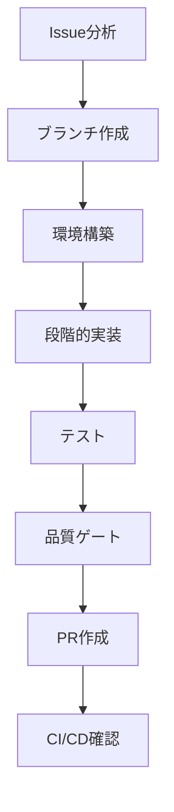

# Issue to PR ワークフローガイド

> spec-workflow-init により自動生成されました。
> 生成日時: 2026-05-21

## ワークフロー概要



## 開発環境

- **言語 / フレームワーク**: Markdown / Skill definitions
- **パッケージマネージャ**: なし
- **コンテナ**: なし
- **データベース**: なし
- **テストフレームワーク**: なし
- **CI/CD**: なし
- **ブランチ戦略**: Git Flow (feature → develop → main)
- **ブランチ命名**: `feature/{issue}-{slug}`
- **PRターゲット**: `develop`
- **開発スタイル**: Implementation First

## 1. Issue分析とセットアップ

### Issue情報の取得

```bash
gh issue view {issue_number}
```

Issueを注意深く読み、以下を特定する:
- 受け入れ基準
- 技術的な制約
- 関連するIssueやPR

### 仕様書の確認

```bash
ls .specs/{project_name}/
cat .specs/{project_name}/requirement.md
cat .specs/{project_name}/design.md
cat .specs/{project_name}/tasks.md
```

### featureブランチの作成

```bash
git checkout develop
git pull origin develop
git checkout -b feature/{issue_number}-{slug}
```

## 2. 環境構築

特別な環境構築は不要です。

## 3. 段階的実装

### Phase 1: 分析と設計

- 関連するソースコードを読み、既存のパターンを理解する
- 依存関係と影響範囲を特定する
- 実装方針を計画する

### Phase 2: コア実装

コーディングルールに従って機能を実装する。

### Phase 3: コードレビューゲート

`docs/review_rules.md` に基づいて実装コードをレビューする。

#### レビュー観点
- review_rules.md（または coding-rules.md）に定義された重大度別チェック（セキュリティ、型安全、パターン準拠等）
- coding-rules.md の [MUST] ルール違反がないか
- レビュー対象外ファイル（review_rules.md で定義）はスキップ

#### レビュー結果の判定

| 重大度 | 検出時のアクション |
|--------|-----------------|
| 重大（セキュリティ・バグ） | 即修正 → 再レビュー |
| 改善提案（品質・可読性） | 修正 → 再レビュー |
| 軽微（スタイル等） | ログのみ、続行可 |

#### 修正ループ（最大3回）
1. レビューで問題を検出
2. 問題箇所を修正
3. 修正箇所のみ再レビュー
4. 繰り返し（最大3回まで）
5. 3回目で未解消の改善提案 → 「軽微」に降格して続行
6. 3回目で未解消の重大指摘 → ユーザーに判断を委ねる
7. レビューパス → 次の Phase へ

セカンドオピニオンが必要な場合は cmux-second-opinion で別AIにレビューを依頼する。

### Phase 4: テスト実装

実装した機能のテストを作成する。

### Phase 5: テストレビューゲート

テストコードをレビューする。コードレビューゲートと同じ修正ループ構造を適用。

#### テスト固有のレビュー観点
- カバレッジが完了条件を満たしているか
- エッジケース・エラーパスのテストがあるか
- テストの独立性（他のテストに依存していないか）
- AAA パターン（Arrange → Act → Assert）に従っているか

#### レビュー結果の判定・修正ループ

（Phase 3 と同じ判定テーブル・修正ループを適用）

### Phase 6: 品質ゲート

このリポジトリ（agent-skills）では、PR前に以下を確認する（CLAUDE.md の Testing 基準）:

- [ ] `SKILL.md` の frontmatter `name` がディレクトリ名と一致する
- [ ] 参照しているファイルがすべて存在する
- [ ] ハードコードされた MCP ツール名（例: `mcp__serena__`, `Context7`）が無い
- [ ] `SKILL.md` が 500 行未満
- [ ] `README.md` / `README.ja.md` のスキル表が更新されている

## 4. テスト

### API E2Eテスト

検証項目:
- 全APIエンドポイントが期待通りのレスポンスを返す
- エラーケースが適切に処理される
- 認証・認可が正しく動作する

> 注: このリポジトリは Markdown スキル集のため、自動テストの代わりに上記の品質ゲート（Phase 6）の手動検証を実施する。

## 5. PR作成と品質ゲート

### PR作成前チェックリスト

- [ ] 品質ゲート（Phase 6）の全項目を確認
- [ ] レビューゲート（Phase 3 / Phase 5）をパス

### PR作成

```bash
gh pr create --base develop --title "feat: {description} (closes #{issue_number})" --body "## 概要
- {summary_points}

## テスト計画
- [ ] スキル定義の品質ゲート確認済み
- [ ] 参照ファイル・README 更新済み

## 関連
- Closes #{issue_number}
- 仕様書: .specs/{project_name}/
"
```

## 6. CI/CD確認

### CIパイプラインの監視

```bash
gh run list --limit 5
gh run watch
```

### エラー復旧

CIが失敗した場合:

1. 失敗したステップを確認:
   ```bash
   gh run view {run_id} --log-failed
   ```
2. ローカルで問題を修正
3. 修正をプッシュ:
   ```bash
   git add -A && git commit -m "fix: CI失敗を修正" && git push
   ```
4. CIを再度監視

## エージェントロール（オプション）

### マルチエージェント役割分担戦略

各工程を専門のエージェントに委任する:

| フェーズ | 実装者 | テスター | レビュアー |
|---------|--------|---------|-----------|
| 分析 | 設計レビュー | テスト計画 | - |
| 実装 | コード作成 | テスト作成 | - |
| レビュー | - | - | コード＋テストレビュー |
| 品質ゲート | - | 全テスト実行 | 最終確認 |

### ロール割り当て

| ロール | エージェント | AI | 責務 |
|--------|-------------|-----|------|
| 実装者 | workflow-implementer | codex | coding-rules.md に従った実装コード作成 |
| レビュアー | workflow-reviewer | claude | coding-rules.md 基準のコードレビュー |
| テスター | workflow-tester | codex | テスト作成・実行、カバレッジ確認 |

### エージェント定義ファイル

- `.claude/agents/workflow-implementer.md` — 実装エージェント
- `.claude/agents/workflow-reviewer.md` — レビューエージェント
- `.claude/agents/workflow-tester.md` — テストエージェント

- `.codex/agents/workflow-implementer.toml` — 実装エージェント
- `.codex/agents/workflow-reviewer.toml` — レビューエージェント
- `.codex/agents/workflow-tester.toml` — テストエージェント

### ランタイム組み込みディスパッチ

- **Codex**: `.codex/agents/workflow-*.toml` の custom agent を使用する。`エージェント` 列の名前で agent を起動し、タスク固有のコンテキストだけを渡す。
- **Claude Code**: `.claude/agents/workflow-*.md` を Claude Code agent team として使用する。Claude Code に、`エージェント` 列の名前に基づく teammate を持つ agent team を作成するよう依頼し、各 teammate にはタスク固有のコンテキストだけを渡す。`CLAUDE_CODE_EXPERIMENTAL_AGENT_TEAMS=1` が必要。
- **フォールバック**: ランタイム組み込み agent が使えない場合は順次実行するか、明示選択された場合のみ cmux dispatch を使う。

## ディスパッチ戦略

- **方式**: cmux
- **実装・テスト**: cmux-delegate で別ペインの Claude Code に委任
- **レビュー**: cmux-second-opinion で別AI（Codex等）に委任
- **前提条件**: CMUX_SOCKET_PATH が設定されていること

### cmux ディスパッチのフロー

1. `CMUX_SOCKET_PATH` を確認
2. cmux-delegate で実装者/テスターを別ペインに起動
3. 実装/テスト完了を検知
4. cmux-second-opinion でレビューを別AIに委任
5. 結果を統合してPR作成

---

> このワークフローは spec-workflow-init で生成されました。プロジェクトの成長に合わせてカスタマイズしてください。
