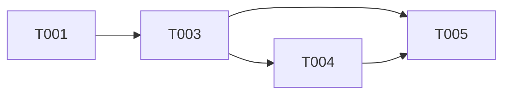

# Tasks Phase - タスクリストの生成

## 概要

タスクリスト（tasks.md）を生成するフェーズ。
design.md を入力として、実装タスクを階層的に分解する。

**重要**: このフェーズはタスクリストの「生成」のみ。実装は行わない。

## 実行手順

### 1. 設計書の特定

```bash
find .specs -name "design.md" -type f
```

設計書から以下を抽出:
- 要件トレーサビリティマトリックス
- モジュール・クラス設計
- 技術スタック
- 実装ガイドライン

### 2. 既存実装の確認

新規 vs 拡張を判断:

```bash
# テストファイル
find . -name "*test*" -o -name "*spec*" -type f -not -path "*/node_modules/*"

# 既存コンポーネント
find . -type f \( -name "*Service*" -o -name "*Controller*" \) -not -path "*/node_modules/*"

# ビルド/開発スクリプト
cat package.json | jq '.scripts | keys[]'
```

### 3. タスク生成原則

1. すべてのタスクは要件IDまたは設計書と紐付け
2. 設計書にない機能のタスクは生成しない
3. 既存実装と重複するタスクは除外
4. 並列実行の機会を最大化

### 4. タスク構造

各タスクに含める項目:

| 項目 | 説明 |
|------|------|
| タスクID | T001, T002... |
| kind | `ui` \| `backend` \| `test` — 作業の性質（必須） |
| 要件ID | REQ-001, NFR-001... |
| タスク名 | 明確で実行可能な説明 |
| 設計書参照 | design.md L:123-145 |
| 依存関係 | 先に完了すべきタスク |
| 推定時間 | 完了までの時間 |
| 対象ファイル | 作成/修正するファイル |
| 完了条件 | 具体的な受け入れ基準 |

### kind ラベル（全タスク詳細に必須）

各タスク詳細の先頭フィールドとして `kind` ラベルを必ず付ける:

| kind | 対象となる作業 |
|------|---------------|
| `ui` | 画面・コンポーネント・スタイリング・クライアント側の操作 |
| `backend` | API・ビジネスロジック・データアクセス・スキーマ・サーバー側ジョブ |
| `test` | テストコード・フィクスチャ・テスト基盤の準備 |

**1タスク1 kind — 混在させない。** 1つのタスクが UI とバックエンドの両方に触れる
場合（例: 「ログイン画面とその認証 API を追加」）は、**2タスクに分割する**
（`kind: ui` と `kind: backend`）。両者の間に明示的な依存を張る。複数 kind の混在
タスクは単一の担当へルーティングできないため許可しない。

`kind` はタスクの性質を表すラベルで、フェーズ単位の `[code]` / `[orchestrator]`
ロールタグ（§8 参照）とは別の軸であり、両方が併存する。`kind` を読まない下流の
スキルは、この追加行を無視するだけで tasks.md をそのまま処理できる（後方互換）。

### 5. タスク階層（--hierarchy）

```
Epic（大規模機能）
└── Story（ユーザーストーリー）
    └── Task（開発タスク）
        └── Subtask（詳細タスク）
```

### 6. 実行戦略（AskUserQuestion で確認）

`--strategy` が未指定の場合、AskUserQuestion で確認:

```
Q1: "タスクの実行戦略は？"
header: "Strategy"
options:
  - "Systematic (Recommended)" / "包括的・体系的。品質ゲート重視"
  - "Agile" / "MVPファースト。スプリント単位で段階リリース"
  - "Enterprise" / "コンプライアンス重視。承認プロセス付き"

Q2: "タスクの粒度は？"
header: "Granularity"
options:
  - "標準（1タスク = 数時間〜1日）(Recommended)"
  - "細かい（1タスク = 1-2時間）"
  - "粗い（1タスク = 1-3日）"
```

| 戦略 | 特徴 |
|------|------|
| systematic | 包括的・体系的、品質ゲート重視 |
| agile | MVPファースト、スプリント単位 |
| enterprise | コンプライアンス重視、承認プロセス |

### 7. 見積もりとリスク（--estimate）

```markdown
- 信頼区間: 0.5h (楽観) / 1h (現実) / 2h (悲観)
- リスクレベル: 低/中/高
- 前提条件: 見積もりの前提
```

### 8. 出力構造

**ロールタグ**: 各フェーズ見出しにはロールタグ `[code]` または `[orchestrator]` を必ず付与する：
- `[code]` — ファイルの作成・修正・生成を伴うタスク（spec-code が担当）
- `[orchestrator]` — コマンド実行と結果確認のみのタスク（git/gh 操作、テスト実行、PR 作成）

**分類ルール:**
| タスクの内容 | ロール |
|---|---|
| ソースファイル、設定、スキーマの作成・変更 | `[code]` |
| コマンドによるファイル生成（マイグレーション等） | `[code]`（生成物のレビューも必要） |
| 既存コマンドの実行と結果確認（npm test, lint） | `[orchestrator]` |
| Git/GitHub 操作（ブランチ、コミット、PR） | `[orchestrator]` |
| 進捗管理（tasks.md のチェック更新） | `[orchestrator]` |

**制約**: 1フェーズ = 1ロール。`[code]` と `[orchestrator]` のタスクを同じフェーズに混在させない。両方ある場合はフェーズを分割する。

**レビューゲートルール**: 全ての `[code]` フェーズの後に、`[orchestrator]` のレビューゲートフェーズを挿入する。このフェーズは、直前の `[code]` フェーズの全タスクに対して spec-review と spec-test を実行する。これにより、レビューが tasks.md に明示的なチェックボックスとして表示され、スキップされることがなくなる。

```markdown
# タスクリスト - [プロジェクト名]

## 1. 概要
設計書に基づくタスク分解

## 2. タスク一覧

### Phase 1: セットアップ・設定 [code]
- [ ] T001: 依存パッケージ追加・設定ファイル作成
- [ ] T002: データベーススキーマ・マイグレーション

### Phase 1-R: セットアップ レビューゲート [orchestrator]
- [ ] T001-R: Phase 1 の spec-review + spec-test 実行

### Phase 2: コア実装 [code]
- [ ] T003: [REQ-001] 認証 API
- [ ] T004: [REQ-001] ログイン画面

### Phase 2-R: コア実装 レビューゲート [orchestrator]
- [ ] T003-R: Phase 2 の spec-review + spec-test 実行

### Phase 3: 品質・リリース [orchestrator]
- [ ] T005: Final Quality Gate（ビルド・Lint・型チェック）
- [ ] T006: PR作成

## 3. タスク詳細

### T001: 依存パッケージ追加・設定ファイル作成
- kind: backend
- 要件ID: -（基盤タスク）
- 設計書参照: design.md L:45-60
- 依存関係: なし
- 推定時間: 1時間
- 対象ファイル: package.json, .env
- 完了条件:
  - [ ] 必要な依存パッケージがプロジェクトに追加済み
  - [ ] 設定ファイルが妥当な初期値で作成済み
  - [ ] 開発環境が正常に起動
- 並列実行: T002と同時実行可能

### T003: [REQ-001] 認証 API
- kind: backend
- 要件ID: REQ-001
- 設計書参照: design.md L:120-180
- 依存関係: T001
- 推定時間: 4時間
- 対象ファイル: src/api/auth.ts
- 完了条件:
  - [ ] ログインエンドポイントが動作
  - [ ] JWTトークンが正しく発行
  - [ ] 単体テストがパス

### T004: [REQ-001] ログイン画面
- kind: ui          # T003 から分割: UI とバックエンドは別 kind
- 要件ID: REQ-001
- 設計書参照: design.md L:120-180
- 依存関係: T003
- 推定時間: 3時間
- 対象ファイル: src/auth/LoginForm.tsx
- 完了条件:
  - [ ] ログインフォームが表示され、認証 API に送信できる
  - [ ] バリデーションエラーがインラインで表示される

## 4. 依存関係図



## 5. 並列実行計画

| フェーズ | 並列実行可能タスク |
|---------|-------------------|
| 1 | T001, T002 |
| 2 | T003（その後 T004） |
| 3 | T005, T006 |
```

### 9. 保存先

```
.specs/[project-name]/tasks.md
```

## プロジェクトタイプ別推奨タスク

### Webアプリケーション
- 国際化対応の基盤実装
- アクセシビリティ対応
- コンポーネントライブラリ統合

### API サーバー
- API仕様書の作成
- エラーハンドリングの統一
- 認証・認可の実装

### データベース連携
- マイグレーションスクリプト
- インデックス設計
- バックアップ戦略（本番向け）

## 除外タスク（YAGNI）

以下は要件に明記がない限り**生成しない**:

- [ ] 詳細な監視・メトリクス収集
- [ ] 管理画面・ダッシュボード
- [ ] 高度なキャッシング戦略
- [ ] 負荷分散・スケーリング設定
- [ ] 詳細なパフォーマンステスト

## 品質チェックリスト

生成後の確認項目:

1. [ ] すべてのタスクが要件IDと紐付いているか
2. [ ] 設計書にない機能のタスクは含まれていないか
3. [ ] 依存関係が明確に定義されているか
4. [ ] 推定時間が現実的か
5. [ ] 完了条件が具体的で測定可能か
6. [ ] 並列実行の機会が最大化されているか
7. [ ] 全タスク詳細に `kind` ラベル（ui / backend / test）があるか
8. [ ] 複数 kind が混在するタスクがないか（混在作業はタスク分割済みか）
