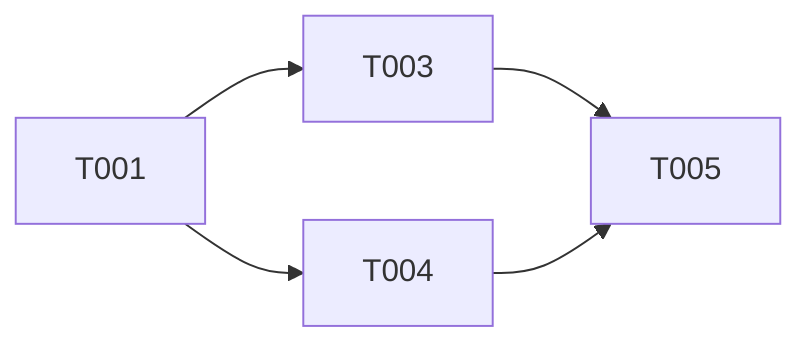

# Tasks Phase — Task List Generation

## Overview

Generate a task list (tasks.md).
Takes design.md as input to decompose implementation into hierarchical tasks.

**Important**: This phase only *generates* the task list. It does not perform implementation.

## Execution Steps

### 1. Locate Design Document

```bash
find .specs -name "design.md" -type f
```

Extract from design document:
- Requirements traceability matrix
- Module/class design
- Technology stack
- Implementation guidelines

### 2. Check Existing Implementation

Determine new vs. extension:

```bash
# Test files
find . -name "*test*" -o -name "*spec*" -type f -not -path "*/node_modules/*"

# Existing components
find . -type f \( -name "*Service*" -o -name "*Controller*" \) -not -path "*/node_modules/*"

# Build/dev scripts
cat package.json | jq '.scripts | keys[]'
```

### 3. Task Generation Principles

1. All tasks must link to a requirement ID or design document section
2. Do not generate tasks for features not in the design document
3. Exclude tasks that overlap with existing implementation
4. Maximize opportunities for parallel execution

### 4. Task Structure

Each task includes:

| Field | Description |
|-------|-------------|
| Task ID | T001, T002... |
| Requirement ID | REQ-001, NFR-001... |
| Task Name | Clear, actionable description |
| Design Reference | design.md L:123-145 |
| Dependencies | Tasks that must complete first |
| Estimated Time | Time to completion |
| Target Files | Files to create/modify |
| Done Criteria | Specific acceptance criteria |

### 5. Task Hierarchy (--hierarchy)

```
Epic (large feature)
└── Story (user story)
    └── Task (development task)
        └── Subtask (detailed task)
```

### 6. Execution Strategy (AskUserQuestion)

If `--strategy` is not specified, confirm with AskUserQuestion:

```
Q1: "Task execution strategy?"
header: "Strategy"
options:
  - "Systematic (Recommended)" / "Comprehensive and structured. Quality gates emphasized"
  - "Agile" / "MVP first. Incremental releases per sprint"
  - "Enterprise" / "Compliance focused. Approval processes included"

Q2: "Task granularity?"
header: "Granularity"
options:
  - "Standard (1 task = a few hours to 1 day) (Recommended)"
  - "Fine-grained (1 task = 1–2 hours)"
  - "Coarse (1 task = 1–3 days)"
```

| Strategy | Characteristics |
|----------|----------------|
| systematic | Comprehensive, structured, quality gate focused |
| agile | MVP first, sprint-based |
| enterprise | Compliance focused, approval processes |

### 7. Estimates and Risks (--estimate)

```markdown
- Confidence interval: 0.5h (optimistic) / 1h (realistic) / 2h (pessimistic)
- Risk level: Low / Medium / High
- Assumptions: Estimation prerequisites
```

### 8. Output Structure

```markdown
# Task List — [Project Name]

## 1. Overview
Task decomposition based on design document

## 2. Task Summary

### Phase 1: Foundation
- [ ] T001: Environment setup
- [ ] T002: Database configuration

### Phase 2: Core Implementation
- [ ] T003: [REQ-001] Authentication
- [ ] T004: [REQ-002] Data management

### Phase 3: Testing & Documentation
- [ ] T005: Unit tests
- [ ] T006: Documentation updates

## 3. Task Details

### T001: Environment Setup
- Requirement ID: — (foundation task)
- Design reference: design.md L:45-60
- Dependencies: None
- Estimated time: 1 hour
- Target files: package.json, .env
- Done criteria:
  - [ ] Dependencies installed
  - [ ] Development environment starts successfully
- Parallel execution: Can run simultaneously with T002

### T003: [REQ-001] Authentication
- Requirement ID: REQ-001
- Design reference: design.md L:120-180
- Dependencies: T001
- Estimated time: 4 hours
- Target files: src/auth/*, src/api/auth.ts
- Done criteria:
  - [ ] Login functionality works
  - [ ] JWT tokens issued correctly
  - [ ] Unit tests pass

## 4. Dependency Graph



## 5. Parallel Execution Plan

| Phase | Parallelizable Tasks |
|-------|---------------------|
| 1 | T001, T002 |
| 2 | T003, T004 |
| 3 | T005, T006 |
```

### 9. Output Location

```
.specs/[project-name]/tasks.md
```

## Recommended Tasks by Project Type

### Web Application
- i18n foundation implementation
- Accessibility compliance
- Component library integration

### API Server
- API specification document
- Unified error handling
- Auth/authz implementation

### Database Integration
- Migration scripts
- Index design
- Backup strategy (for production)

## Excluded Tasks (YAGNI)

Do **not** generate unless explicitly specified in requirements:

- [ ] Detailed monitoring/metrics collection
- [ ] Admin dashboards
- [ ] Advanced caching strategies
- [ ] Load balancing/scaling configuration
- [ ] Detailed performance testing

## Quality Checklist

Post-generation verification:

1. [ ] All tasks linked to requirement IDs
2. [ ] No tasks for features not in the design document
3. [ ] Dependencies clearly defined
4. [ ] Time estimates are realistic
5. [ ] Done criteria are specific and measurable
6. [ ] Parallel execution opportunities maximized
