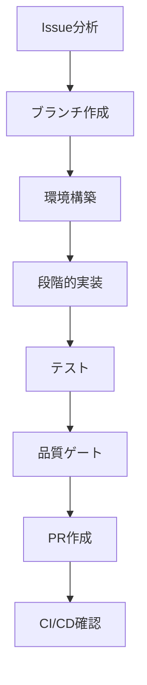

# Issue to PR ワークフローガイド

> spec-workflow-init により自動生成されました。
> 生成日時: {timestamp}

## ワークフロー概要



## 開発環境

- **言語 / フレームワーク**: {language} / {framework}
- **パッケージマネージャ**: {package_manager}
- **コンテナ**: {container_tool}
- **データベース**: {database}
- **テストフレームワーク**: {test_framework}
- **CI/CD**: {ci_service}
- **ブランチ戦略**: {branch_strategy}
- **ブランチ命名**: `{branch_naming}`
- **PRターゲット**: `{pr_target}`
- **開発スタイル**: {dev_style}

## 1. Issue分析とセットアップ

### Issue情報の取得

```bash
gh issue view {issue_number}
```

Issueを注意深く読み、以下を特定する:
- 受け入れ基準
- 技術的な制約
- 関連するIssueやPR

### 仕様書の確認

```bash
ls .specs/{project_name}/
cat .specs/{project_name}/requirement.md
cat .specs/{project_name}/design.md
cat .specs/{project_name}/tasks.md
```

### featureブランチの作成

```bash
git checkout {pr_target}
git pull origin {pr_target}
git checkout -b {branch_naming_example}
```

## 2. 環境構築

<!-- NestJS / Docker プロジェクト -->
<!-- ```bash
docker compose up -d
docker compose exec {service} {package_manager} install
``` -->

<!-- 非Dockerプロジェクト -->
<!-- ```bash
{package_manager} install
``` -->

{environment_setup_commands}

## 3. 段階的実装

<!-- BEGIN: Implementation First -->
{if_implementation_first}

### Phase 1: 分析と設計

- 関連するソースコードを読み、既存のパターンを理解する
- 依存関係と影響範囲を特定する
- 実装方針を計画する

### Phase 2: コア実装

コーディングルールに従って機能を実装する。

```bash
# 開発サーバーを起動して変更を確認
{dev_command}
```

### Phase 3: コードレビュー

実装コードをレビューする:
- coding-rules.md への準拠を確認
- セキュリティ脆弱性のチェック
- 適切なエラーハンドリングの確認

### Phase 4: テスト実装

実装した機能のテストを作成する。

```bash
# テスト実行
{test_command}
```

### Phase 5: テストレビュー

テストコードをレビューする:
- 十分なカバレッジの確認
- エッジケースのチェック
- テストの独立性の確認

### Phase 6: 品質ゲート

```bash
{lint_command}
{typecheck_command}
{build_command}
{test_command}
```

{end_implementation_first}
<!-- END: Implementation First -->

<!-- BEGIN: TDD -->
{if_tdd}

### Phase 1: 分析と設計

- 関連するソースコードを読み、既存のパターンを理解する
- 依存関係と影響範囲を特定する
- テストと実装の方針を計画する

### Phase 2: テスト実装（RED）

期待する振る舞いを定義する失敗テストを作成する。

```bash
# テスト実行 - 失敗するはず
{test_command}
```

### Phase 3: コア実装（GREEN）

全テストを通す最小限のコードを実装する。

```bash
# テスト実行 - 通るはず
{test_command}
```

### Phase 4: リファクタリング

テストをグリーンに保ちながらリファクタリングする。

```bash
# リファクタリング後もテストが通ることを確認
{test_command}
```

### Phase 5: コードレビュー

実装コードとテストコードをまとめてレビューする:
- coding-rules.md への準拠を確認
- セキュリティ脆弱性のチェック
- 適切なエラーハンドリングとテストカバレッジの確認

### Phase 6: 品質ゲート

```bash
{lint_command}
{typecheck_command}
{build_command}
{test_command}
```

{end_tdd}
<!-- END: TDD -->

<!-- BEGIN: BDD -->
{if_bdd}

### Phase 1: 分析と設計

- 関連するソースコードを読み、既存のパターンを理解する
- ユーザーシナリオと期待する振る舞いを定義する
- E2Eテストシナリオを計画する

### Phase 2: E2Eシナリオ定義

クリティカルパスのE2Eテストシナリオを定義する:
- 正常系シナリオ
- エラーハンドリングシナリオ
- エッジケースシナリオ

### Phase 3: テスト実装（RED）

シナリオに基づいて失敗するE2Eテストとユニットテストを作成する。

```bash
# テスト実行 - 失敗するはず
{test_command}
{e2e_test_command}
```

### Phase 4: コア実装（GREEN）

全テストを通すように機能を実装する。

```bash
# テスト実行 - 通るはず
{test_command}
{e2e_test_command}
```

### Phase 5: コードレビュー

実装コードとテストコードをレビューする:
- coding-rules.md への準拠を確認
- E2Eシナリオカバレッジの確認
- 適切なエラーハンドリングの確認

### Phase 6: 品質ゲート

```bash
{lint_command}
{typecheck_command}
{build_command}
{test_command}
{e2e_test_command}
```

{end_bdd}
<!-- END: BDD -->

## 4. テスト

### API E2Eテスト

```bash
{e2e_test_command}
```

検証項目:
- 全APIエンドポイントが期待通りのレスポンスを返す
- エラーケースが適切に処理される
- 認証・認可が正しく動作する

<!-- BEGIN: ブラウザE2E -->
{if_browser_e2e}

### ブラウザE2Eテスト

```bash
{browser_e2e_command}
```

テスト対象のクリティカルパス:
- ログイン / 認証フロー
- 主要なユーザージャーニー（メイン機能）
- フォーム送信とバリデーション
- ナビゲーションとルーティング

{end_browser_e2e}
<!-- END: ブラウザE2E -->

## 5. PR作成と品質ゲート

### PR作成前チェックリスト

- [ ] 全テスト通過: `{test_command}`
- [ ] Lint通過: `{lint_command}`
{if_typecheck}- [ ] 型チェック通過: `{typecheck_command}`
{end_typecheck}{if_build}- [ ] ビルド成功: `{build_command}`
{end_build}{if_coverage}- [ ] カバレッジ基準達成: `{coverage_command}`
{end_coverage}{if_browser_e2e_gate}- [ ] ブラウザE2E通過: `{browser_e2e_command}`
{end_browser_e2e_gate}
### PR作成

```bash
gh pr create --base {pr_target} --title "feat: {description} (closes #{issue_number})" --body "## 概要
- {summary_points}

## テスト計画
- [ ] ユニットテスト追加・更新
- [ ] API E2Eテスト検証済み
{if_browser_e2e_pr}- [ ] ブラウザE2Eテスト検証済み
{end_browser_e2e_pr}
## 関連
- Closes #{issue_number}
- 仕様書: .specs/{project_name}/
"
```

## 6. CI/CD確認

### CIパイプラインの監視

```bash
gh run list --limit 5
gh run watch
```

### エラー復旧

CIが失敗した場合:

1. 失敗したステップを確認:
   ```bash
   gh run view {run_id} --log-failed
   ```
2. ローカルで問題を修正
3. 修正をプッシュ:
   ```bash
   git add -A && git commit -m "fix: CI失敗を修正" && git push
   ```
4. CIを再度監視

## エージェントロール（オプション）

{if_parallel}

### 並列実行戦略

実装とテストコード生成を並列で実行する:

| フェーズ | 実装者 | テスター | レビュアー |
|---------|--------|---------|-----------|
| 分析 | 設計レビュー | テスト計画 | - |
| 実装 | コード作成 | テスト作成 | - |
| レビュー | - | - | コード＋テストレビュー |
| 品質ゲート | - | 全テスト実行 | 最終確認 |

### ロール割り当て

| ロール | エージェント | 責務 |
|--------|-------------|------|
| 実装者 | workflow-implementer | coding-rules.md に従った実装コード作成 |
| レビュアー | workflow-reviewer | coding-rules.md 基準のコードレビュー |
| テスター | workflow-tester | テスト作成・実行、カバレッジ確認 |

{end_parallel}

---

> このワークフローは spec-workflow-init で生成されました。プロジェクトの成長に合わせてカスタマイズしてください。

<!-- プロジェクト種別コマンド例 -->
<!-- NestJS: docker compose exec api pnpm test, pnpm lint, pnpm build -->
<!-- Next.js: pnpm test, pnpm lint, pnpm build (next build) -->
<!-- Go: go test ./..., golangci-lint run, go build ./... -->
<!-- Python: pytest, ruff check ., mypy ., python -m build -->
