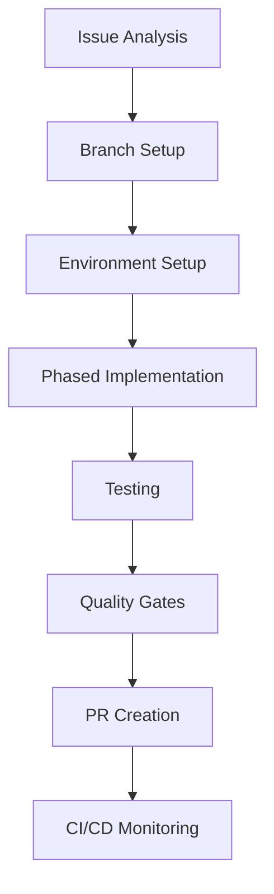

# Issue to PR Workflow Guide

> Auto-generated by spec-workflow-init.
> Generated: {timestamp}

## Workflow Overview



## Development Environment

- **Language / Framework**: {language} / {framework}
- **Package Manager**: {package_manager}
- **Container**: {container_tool}
- **Database**: {database}
- **Test Framework**: {test_framework}
- **CI/CD**: {ci_service}
- **Branch Strategy**: {branch_strategy}
- **Branch Naming**: `{branch_naming}`
- **PR Target**: `{pr_target}`
- **Development Style**: {dev_style}

## 1. Issue Analysis and Setup

### Get Issue Information

```bash
gh issue view {issue_number}
```

Read the issue carefully. Identify:
- Acceptance criteria
- Technical constraints
- Related issues or PRs

### Check Specifications

```bash
ls .specs/{project_name}/
cat .specs/{project_name}/requirement.md
cat .specs/{project_name}/design.md
cat .specs/{project_name}/tasks.md
```

### Create Feature Branch

```bash
git checkout {pr_target}
git pull origin {pr_target}
git checkout -b {branch_naming_example}
```

## 2. Environment Setup

<!-- NestJS / Docker project -->
<!-- ```bash
docker compose up -d
docker compose exec {service} {package_manager} install
``` -->

<!-- Non-Docker project -->
<!-- ```bash
{package_manager} install
``` -->

{environment_setup_commands}

## 3. Phased Implementation

<!-- BEGIN: Implementation First -->
{if_implementation_first}

### Phase 1: Analysis and Design

- Read related source code and understand existing patterns
- Identify dependencies and affected components
- Plan the implementation approach

### Phase 2: Core Implementation

Implement the feature following the coding rules.

```bash
# Run development server to verify changes
{dev_command}
```

### Phase 3: Code Review

Review the implementation code:
- Verify coding-rules.md compliance
- Check for security vulnerabilities
- Ensure proper error handling

### Phase 4: Test Implementation

Write tests for the implemented feature.

```bash
# Run tests
{test_command}
```

### Phase 5: Test Review

Review the test code:
- Verify sufficient coverage
- Check edge cases
- Ensure test isolation

### Phase 6: Quality Gate

```bash
{lint_command}
{typecheck_command}
{build_command}
{test_command}
```

{end_implementation_first}
<!-- END: Implementation First -->

<!-- BEGIN: TDD -->
{if_tdd}

### Phase 1: Analysis and Design

- Read related source code and understand existing patterns
- Identify dependencies and affected components
- Plan the test and implementation approach

### Phase 2: Test Implementation (RED)

Write failing tests that define the expected behavior.

```bash
# Run tests - they should FAIL
{test_command}
```

### Phase 3: Core Implementation (GREEN)

Write the minimum code to make all tests pass.

```bash
# Run tests - they should PASS
{test_command}
```

### Phase 4: Refactoring

Refactor while keeping tests green.

```bash
# Verify tests still pass after refactoring
{test_command}
```

### Phase 5: Code Review

Review implementation and test code together:
- Verify coding-rules.md compliance
- Check for security vulnerabilities
- Ensure proper error handling and test coverage

### Phase 6: Quality Gate

```bash
{lint_command}
{typecheck_command}
{build_command}
{test_command}
```

{end_tdd}
<!-- END: TDD -->

<!-- BEGIN: BDD -->
{if_bdd}

### Phase 1: Analysis and Design

- Read related source code and understand existing patterns
- Define user scenarios and expected behaviors
- Plan E2E test scenarios

### Phase 2: E2E Scenario Definition

Define E2E test scenarios for the critical paths:
- Happy path scenarios
- Error handling scenarios
- Edge case scenarios

### Phase 3: Test Implementation (RED)

Write failing E2E and unit tests based on the scenarios.

```bash
# Run tests - they should FAIL
{test_command}
{e2e_test_command}
```

### Phase 4: Core Implementation (GREEN)

Implement the feature to make all tests pass.

```bash
# Run tests - they should PASS
{test_command}
{e2e_test_command}
```

### Phase 5: Code Review

Review implementation and test code:
- Verify coding-rules.md compliance
- Check E2E scenario coverage
- Ensure proper error handling

### Phase 6: Quality Gate

```bash
{lint_command}
{typecheck_command}
{build_command}
{test_command}
{e2e_test_command}
```

{end_bdd}
<!-- END: BDD -->

## 4. Testing

### API E2E Tests

```bash
{e2e_test_command}
```

Verify:
- All API endpoints return expected responses
- Error cases are handled properly
- Authentication and authorization work correctly

<!-- BEGIN: Browser E2E -->
{if_browser_e2e}

### Browser E2E Tests

```bash
{browser_e2e_command}
```

Critical paths to test:
- Login / Authentication flow
- Primary user journey (main feature)
- Form submissions and validations
- Navigation and routing

{end_browser_e2e}
<!-- END: Browser E2E -->

## 5. PR Creation and Quality Gates

### Pre-PR Checklist

- [ ] All tests pass: `{test_command}`
- [ ] Lint passes: `{lint_command}`
{if_typecheck}- [ ] Type check passes: `{typecheck_command}`
{end_typecheck}{if_build}- [ ] Build succeeds: `{build_command}`
{end_build}{if_coverage}- [ ] Coverage meets threshold: `{coverage_command}`
{end_coverage}{if_browser_e2e_gate}- [ ] Browser E2E passes: `{browser_e2e_command}`
{end_browser_e2e_gate}
### Create PR

```bash
gh pr create --base {pr_target} --title "feat: {description} (closes #{issue_number})" --body "## Summary
- {summary_points}

## Test Plan
- [ ] Unit tests added/updated
- [ ] API E2E tests verified
{if_browser_e2e_pr}- [ ] Browser E2E tests verified
{end_browser_e2e_pr}
## Related
- Closes #{issue_number}
- Spec: .specs/{project_name}/
"
```

## 6. CI/CD Monitoring

### Monitor CI Pipeline

```bash
gh run list --limit 5
gh run watch
```

### Error Recovery

If CI fails:

1. Check the failed step:
   ```bash
   gh run view {run_id} --log-failed
   ```
2. Fix the issue locally
3. Push the fix:
   ```bash
   git add -A && git commit -m "fix: resolve CI failure" && git push
   ```
4. Monitor CI again

## Agent Roles (Optional)

{if_parallel}

### Parallel Execution Strategy

Implementation and test code generation run in parallel:

| Phase | Implementer | Tester | Reviewer |
|-------|-------------|--------|----------|
| Analysis | Design review | Test plan | - |
| Implementation | Write code | Write tests | - |
| Review | - | - | Review code + tests |
| Quality Gate | - | Run all tests | Final check |

### Role Assignment

| Role | Agent | Responsibility |
|------|-------|---------------|
| Implementer | workflow-implementer | Write implementation code following coding-rules.md |
| Reviewer | workflow-reviewer | Code review against coding-rules.md standards |
| Tester | workflow-tester | Write and run tests, verify coverage |

{end_parallel}

---

> This workflow was generated by spec-workflow-init. Customize it to match your project's evolving needs.

<!-- Project-Type Command Examples -->
<!-- NestJS: docker compose exec api pnpm test, pnpm lint, pnpm build -->
<!-- Next.js: pnpm test, pnpm lint, pnpm build (next build) -->
<!-- Go: go test ./..., golangci-lint run, go build ./... -->
<!-- Python: pytest, ruff check ., mypy ., python -m build -->
