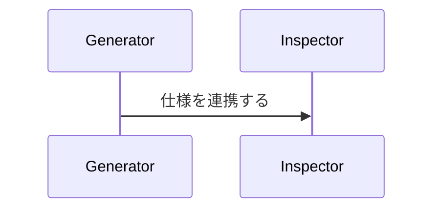
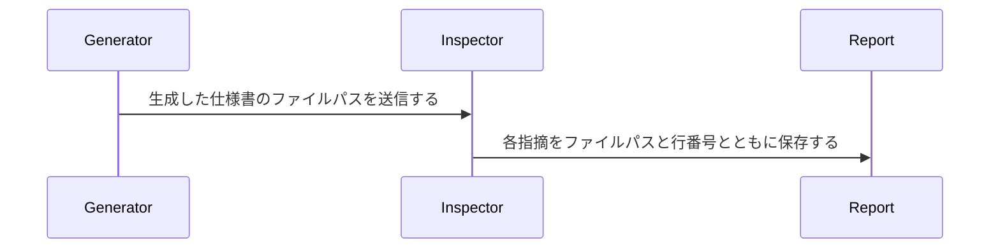

# 仕様書の文章規範

日本語の仕様書を生成または修正するときに適用する。`SW-*` は英語版と共通の規則 ID であり、`JA-*` は日本語だけに適用する。

## 共通規則

| ID | 規則 |
|---|---|
| SW-001 | 処理を説明するときは、主体、開始条件または入力、観測できる動作、結果の渡し先を追えるように書く。 |
| SW-002 | 概要では一般名を使って処理順を説明し、型名、関数名、イベント名、保存先の識別子は実装者向けの節へ置く。 |
| SW-003 | 因果関係には処理機構を添え、根拠のない断定、緩和、強調、予告、総括、称賛を書かない。 |
| SW-004 | シーケンス図の各メッセージに送信データを書き、受信側が次に実行する動作を直後のメッセージまたは注記で示す。 |

## SW-001：処理説明の4点

処理の説明から、次の4点を判断できるようにする。

1. **主体**：サービス、関数、利用者、エージェントなど、動作を実行するもの。
2. **開始条件または入力**：処理を始めるイベント、状態、引数、ファイル。
3. **観測できる動作**：保存、比較、計算、送信、拒否、停止など、実装で確認できる操作。
4. **結果の渡し先**：データベース、API、イベント、ファイル、画面、受信者など、結果を保存または送信する場所。

4点を一文へ詰め込む必要はない。同じ箇条書き、段落、またはシーケンス図の近接するメッセージから関係を一意に追えればよい。

悪い例：

> AI SDK の step を既存の `Run.steps` と `agent-step` イベントへ写像する。

修正文：

> AI SDK が step の開始を通知したら、orchestrator は進捗を `Run.steps` へ保存し、同じ進捗を `agent-step` イベントとしてクライアントへ送信する。

修正文には、開始条件、主体、保存と送信という動作、二つの渡し先が含まれている。

## SW-002：読者層を分ける

概要では、実装を知らない読者も責務と処理順を追える一般名を使う。実装者向けの節では、実装に必要な型名、関数名、イベント名、テーブル名、ファイルパスを示す。

実装者が必要とする識別子は削らず、実装の詳細を読む節へ移す。

## SW-003：検証できる論証を書く

- A が B を引き起こすと主張する場合は、A から B に至る操作または条件を書く。
- 仕様から確定できる範囲だけを断定する。値、依存関係、結果が未確定なら不確実性を残す。
- 節の内容を予告するだけの文、結論を言い換えるだけの文、手法を称賛するだけの文、重要だと宣言するだけの文は削る。
- 抽象的な形容詞や動詞は、その語が隠している制約、動作、根拠、トレードオフへ書き換える。

悪い例：

> この堅牢な設計により、信頼性が大幅に向上する。

修正文：

> ポリシーサービスがタイムアウトした場合、認可ゲートウェイはリクエストを拒否して再試行可能なエラーを返すため、呼び出し側はポリシーの判定なしに処理を続行できない。

## SW-004：シーケンス図のメッセージを書く

シーケンス図の矢印には、送信するデータまたはコマンドを書く。受信した参加者が次に実行する動作は、直後のメッセージまたは隣接する注記へ書く。

悪い例：

修正文：

## 日本語固有の規則

| ID | 規則 |
|---|---|
| JA-001 | コード、API、予約語、型名、固有名詞、コマンドは原綴りを使う。定着した外来語はカタカナで書き、日本語にできる一般語は訳す。 |
| JA-002 | 「実現する」「提供する」「可能にする」などの翻訳調の述語だけで効果を示さず、主体が実行する動作と結果を書く。 |
| JA-003 | 日本語の語間に脈絡のない半角空白を入れない。コード識別子と助詞の境界など、読み分けに必要な空白は残す。 |

### JA-001：外来語と原綴り

現場のエンジニアが読むときの慣用に合わせる。`after_create`、`users`、HTTP などの識別子や固有名詞は原綴りを保つ。テーブル、コミット、レビューなど定着した語はカタカナでよい。一般語を英語のまま混ぜず、日本語で具体的に書く。

### JA-002：翻訳調の述語

「検証を可能にする」とだけ書かず、誰が何を比較し、結果をどこへ記録するかを書く。「サポートする」「提供する」も、実際の動作を特定できない場合は同様に直す。

### JA-003：空白

全角文の語間に紛れた半角空白は削る。ただし、コード識別子を読み分けるための空白や Markdown の構文に必要な空白は削らない。
