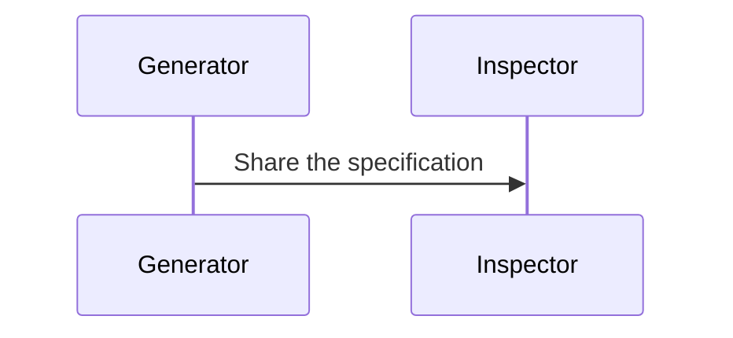
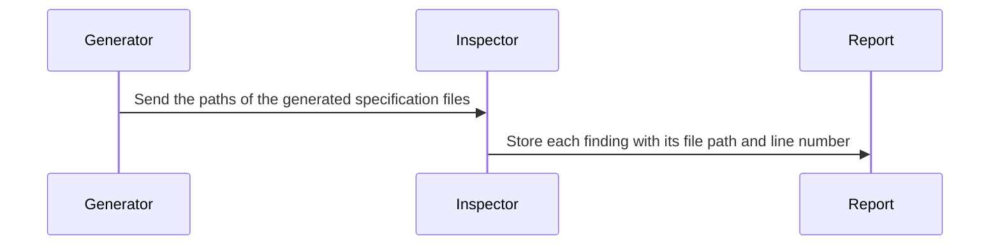

# Specification Writing Rules

Apply these rules when generating or revising an English specification. The `SW-*` identifiers form the shared contract with the Japanese version.

## Common Rules

| ID | Rule |
|---|---|
| SW-001 | Make the actor, trigger or input, observable action, and result destination traceable in each process description. |
| SW-002 | Explain the process order with general system names in an overview; move types, functions, events, and storage identifiers to an implementation-facing section. |
| SW-003 | State the mechanism behind causal claims; remove unsupported certainty, hedging, intensifiers, previews, summaries, and praise that add no specification information. |
| SW-004 | Name the data sent in every sequence-diagram message and show the receiver's next observable action in an adjacent message or note. |

## SW-001: Four Process Elements

A process description must let the reader identify:

1. **Actor**: the service, function, user, or agent that performs the action.
2. **Trigger or input**: the event, state, argument, or file that starts the action.
3. **Observable action**: an implementation-visible operation such as storing, comparing, calculating, sending, rejecting, or stopping.
4. **Result destination**: the database, API, event, file, screen, or consumer that receives the result.

The four elements may span one sentence, one list item, one paragraph, or adjacent sequence-diagram messages when their relationship is unambiguous.

Bad example:

> Map AI SDK steps to the existing `Run.steps` and `agent-step` event.

Rewritten example:

> When the AI SDK reports that a step started, the orchestrator stores the progress in `Run.steps` and sends the same progress to the client in an `agent-step` event.

The rewritten example names the trigger, actor, storage action, send action, and both destinations.

## SW-002: Separate Reader Layers

An overview explains responsibilities and process order with names a reader can understand without knowing the implementation. An implementation-facing section then provides the exact types, functions, event names, table names, or file paths needed to build the behavior.

Do not remove an identifier that an implementer needs. Move it to the section where the reader expects implementation detail.

## SW-003: Make Reasoning Testable

- When claiming that A causes B, state the operation or condition that connects them.
- Use certainty only when the specification establishes the claim. Preserve uncertainty when a value, dependency, or outcome is genuinely unresolved.
- Remove sentences that only announce a section, repeat its conclusion, praise an approach, or label it as important.
- Replace generic adjectives and verbs with the constraint, action, evidence, or tradeoff they conceal.

Bad example:

> This robust design significantly improves reliability.

Rewritten example:

> If the policy service times out, the authorization gateway rejects the request and returns a retryable error, so the caller cannot continue without a policy decision.

## SW-004: Describe Sequence Messages

Each sequence-diagram arrow must name the data or command being sent. The receiving participant's next observable action must appear in the immediately following message or an adjacent note.

Bad example:

Rewritten example:

